# Innholdsfortegnelse
- [Hva er nettsiden](#item-one)
- [Hvordan funker den](#item-two)
- [Hvordan bruke kart siden](#item-three)
- [Hvordan bruke liste siden](#item-four)
- [Hvordan bruke graf siden](#item-five)
- [Hvordan laste ned data](#item-six)
- [Hvordan laste opp ny data](#item-seven)

# Hva er nettsiden

Denne nettsiden er laget på vegne av Norsk Institutt for Naturforskning (NINA). Nettsiden er et hjelpemiddel basert på data lagret i en strukturert database. Dennne dataen er samlet av NINA på sine mange turer i norske elver, hvor de observerer fiskebestanden. Nettsiden muligjør visualisering av dataene, og gjør det lett å studere, vurdere og analysere dataene som er observert. Den inneholder også funskjonalitet for å laste opp ny data til databasen, eller laste ned eksisterende data i en strukturert excel fil.

# Hvordan funker den

Netsiden har 5 sider; Kart, Liste, Graf, Last opp, Last ned. Disse sidene har ulike formål og bruksområder. For å bytte mellom de ulike sidene er det bare å trykke på navnet til siden man ønsker å gå til.

Flere steder på de ulike sidene ser man menyer som ser slik ut:

Dette viser at menyen kan åpnes og lukkes. Er man ferdig med alt som står under denne menyen, kan man lukke den for å gi mer plass til andre elementer, og for å gjøre siden lettere å forstå.

# Hvordan bruke kart siden

Kart siden er en visuell framstilling av dataene som er lagret, og viser lokasjon til alle ulike elver og stasjoner som har blitt besøkt. Det største delen av siden er selve kartet. Når man først åpner siden, så vises det en del blå punkter. Blå punkter tilsvarer elver, mens røde tilsvarer stasjoner. Man kan ikke se både elver og stasjor samtidig, men man kan enkelt bytte mellom de to ulike typen punkter. En stasjon består av to punkter (start og slutt), med en linje mellom de for å vise at de hører sammen.

Siden til venstre heter Filter, og bestemmer hvilke av punktene som vises på kartet. Under muligheten for å velge typen data som vises, har man feltet Dato(1). 

I Dato feltet kan man sette en start dato (fra), en slutt dato (til), eller begge. Definerer man en start dato, så vises bare alle stasjonene/elvene som ble besøkt etter datoen. Setter man f.eks. start dato som 31. Desember 2015, så vil alle obervasjoner gjort før 2015 ikke vises på kartet. Setter man slutt dato til 1. Januar 2016, så vises bare obervasjoner gjort før 2015. Setter man begge samtidig, så vises bare observasjoner gjort inne i interavellet. Setter man 31. Desember 2015 i "fra", og 1. Januar 2016 i "til" så vil mest sannsynlig ingenting vises, siden intervallet bare er 2 dager (31 desember til 1. Januar ), og disse er fridager.

I Art feltet(2) så har man mulighet til å begrense punktene som vises på kartet basert på spesefikke arter. Dette feltet er automatisk satt til "Velg alle", som betyr at det ikke er noen restriksjoner og alle punktene som finnes vil vises på kartet. Velger man egendefinert, bestemmer man selv hvilke arter som vises. Det vil si, velger man arten laks så vises bare elver/stasjoner hvis det har blitt observert minst en laks i elven/stasjonen. Velger man flere arter, så vises elvene/stasjonene hvor det er blitt observert minst en av disse.

I tilfellet over, så er "Laks" og "Ørekyte" valgt, og typen data er "elvedata". Da vil punkter som tilhører elver hvor enten laks eller ørekyte (eller begge) har blitt observert.

Hvis man synes filter siden tar for mye plass, og ønsker og lukke den er det bare å trykke på knappen til høyre på Filter menyen.

Det finnes flere valgmuligheter for selve kartet. Det første et at man kan zoome inn og ut. Dette ser man øverst i høyre hjørne, men man kan også zoome på kartet ved bruk av mus/touchpad. Ved mus så må man "scrolle" med hjulet, mens på touchpad så man må knipe fingrene sammen/fra hverandre. På bildet under er det zoomet inn på stasjonspunktne i elven Gaula. 

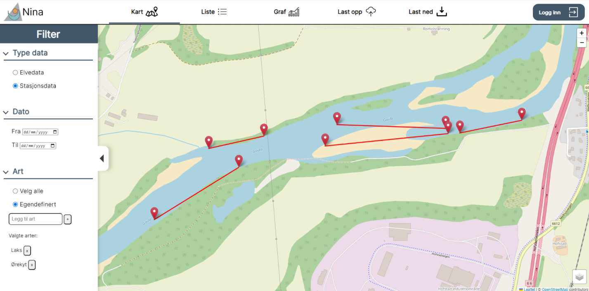

Man kan også velge mellom ulike typer kart. Dette gjør man nederst i høyre hjørne. Man kan vegle mellom terreng, satelitt og topologisk.

Alle punktene på kartet er interaktive, som vil si at man kan trykke på de. Trykker man på et punkt for man opp all dataen for det punktet. Dataen varierer utifra om man har trykket på et elvedatapunkt eller et stasjonsdatapunkt. En stasjon består som sagt av to punkter og en linje, men det telles som et objekt. Trykker man på start/slutt punktet, så vises samme data. Et valgt punkt blir oransje, dette gjelder for både elver og stasjoner.

# Hvordan bruke liste siden

Liste siden fungerer veldig likt som kart siden, men istedenfor at alle stasjonene/elvene er plassert på et kart utifra sine kordinater, ligger de nå i en lang liste. Dette er ideelt hvis man ønsker å søke etter en spesefikk stasjon/elv som man ikke vet hvor er.

Filteret på venstre side fungerer på samme måte som på kart siden. Hvis man ønsker detaljer kan man lese der. Hovedsakelig så bestemmer filter siden hva slags data som vises. Selve funksjonaliteten på liste siden er enkel, det er bare å søke etter det man ønsker.

For elver kan man søke på navn eller prosjektnummer, mens for stasjoner kan man bare søke etter navn. Søkefeltet er ikke case-sensetiv og viser alle resultater som inneholder søkemønsteret som har blitt valgt. Søker man for eksempel bare "a", så får man opp alle elver/stasjoner som innehoder bokstaven "a" eller "A". 

Selve listen kan sorteres utifra de tre kolonnene. Kolonnene er ikke like for elvedata og stasjonsdata, men sorteringen fungerer på samme måte. Listen er automatisk sortert **etter hva????**, dette gjelder for både elver og stasjoner. Ønsker man å sortere basert på dato, er det bare å trykke på "dato". Under kan man se listen sortert i synkende rekkefølge basert på dato. De eldste observasjonene vises først i listen. 

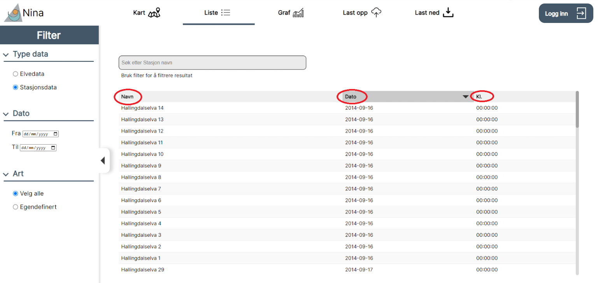

Hvis målet var å se de nyeste obervasjonene, så er det bare å trykke på "dato" igjen. Da blir listen basert i synkende rekkefølge basert på dato. Trykker man en tredje gang på "dato", så går listen tilbake til "default", altså sortert **etter hva????**.

Hvis man ønsker mer detaljer for en av observasjonene i listen er det bare å trykke på den. På bildet under har jeg valgt elven Gaula.

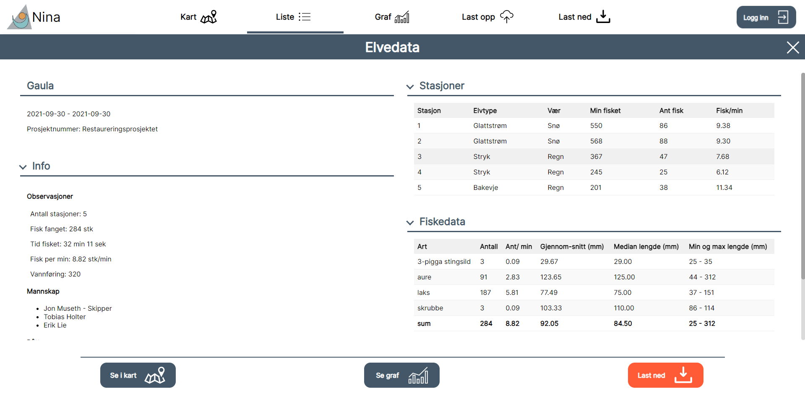

Her vises all informasjon knyttet til en elv. Trykker man på en stasjon er siden annerledes, og det er fordi data knyttet til en stasjon er annerledes enn en elv. Noe som er verdt å legge merke til, er scroll baren til venstre. Den tyder på at hele siden ikke vises, som vil si at man må scrolle ned for å se resten av dataene.

På bunnen er det tre knapper. Trykker man på "se i Kart" så går men over til kart siden, og elve punktet som hører til elven vi valgte i liste siden, blir automatisk valgt. Dette gjør at man kan se hvor elven er på kartet. Trykker man på "se graf", så går men over til graf siden. Her kan man gjøre analyse på den elven man valgte i liste siden.

# Hvordan bruke graf siden

Graf siden gir muligheten til å visualisere alle dataene rundt fisker oberservert i ulike elver og stasjoner. Dette gjøres ved hjelp av ulike figurer og diagrammer.

Det første å tenke på er "Filter for grafer", som er menyen på venstre av siden. Det er denne som bestemmer hva slags data som vises, og hvordan den vises. Det første valget man har, er hva slags elver og stasjoner man er interresert i. Graf siden visualierer fiskedata knyttet til stasjoner og elver, så fiskedataene vil variere utifra hvilke stasjoner/elver som er valgt. For å velge stasjoner eller elver, trykker man på rediger. Det er mulig å velge en eller flere stasjoner/elver, men ikke begge samtidig. Velger man f.eks. en elv, så kan man sammenligne dataene for de ulike fiskene i elven og se blant annet hvilken type fisk det var mest av. Velger man flere elver så kan man blant annet sammenligne antall fisker mellom elvene.

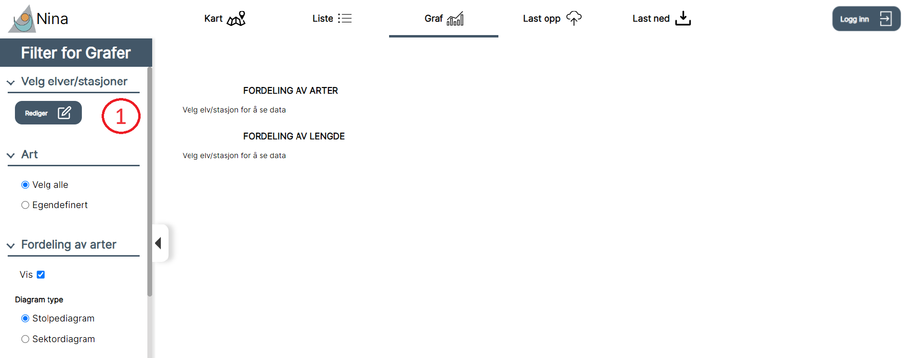

Det første man kan endre på, er om man skal laste ned "Elvedata" eller "Stasjonsdata". **Skrive noe om forskjellen mellom de**. Under dette har man mulighet til å sette et tidsrom som man ønsker å lete etter data fra. "Filtrer søk på dato" vil ikke legge til noe data, men det legger restriksjoner på hvilke stasjoner/elver som vises når man skal legge de til senere.Dette er nyttig hvis man ikke er ute etter en spesefikk elv eller stasjon, man ønsker å se på alle målinger gjort i et vist tidsrom. Det er også greit for elver/stasjoner der det er gjort målinger flere ganger, fordi da for man filtrert vekk de målingene man ikke er interessert i. 

Det siste feltet på denne siden er der man faktisk bestemmer hvilke av stasjonene/elvene man faktisk vil bruke. Det er et søkefelt, og alle stasjoner/elver som passer til søket vil vises. Husk, man får ikke opp stasjoner OG elver. Valgte man elvedata på det først feltet kan man bare søke etter elver, og valgte man stasjonsdata kan man bare søke etter stasjoner. Søkefeltet er ikke case-sensetiv og viser alle resultater som inneholder søkemønsteret som har blitt valgt. Velger man for eksempel bare å søke "a", så får man opp alle elver/stasjoner som innehoder bokstaven "a" eller "A". Når man har valgt elvene/stasjonene man er interresert i, så er det bare å trykke ferdig.

Den neste filtermuligheten er "Art"(2). Å bruke filteret er lignende som på kart siden og liste siden, men funksjonaliteten er ikke helt lik. Artene man velger her, er de som vil bli med i figurene og diagrammene. Velger man f.eks. ørret, så vil figurene bare inneholde fiskedata til ørret i de valgte elvene/stasjonene. Muligheten til å velge arter er spesielt nyttig når flere elver/stasjoner er valgt. Det vil ofte være veldig mange arter da, og det kan være fordelaktig og fokuserer på de artene som man er interesert i. Det siste å merke seg med denne filtermuligheten, er at velger man egendefinert for arter får man muligheten til å velge "Grupper og vis ikke valgte arter sammen". Dette vil si at alle artene som ikke er valgt, blir aggregert og telt som en art. Dette er nyttig når det er en eller noen få arter dominerer, for da kan man sammenligne denne arten med resten. Under kan man se hvordan dette bli brukt, det er enkelt å se at det ble observert flere laks enn alle andre arter total, i begge elvene som er valgt.

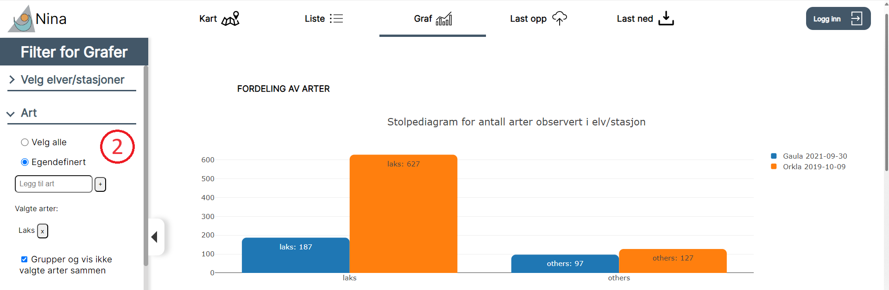

De to første filtetmuligheten fokuserte på hvilke data som vises, mens de to neste fokuserer på hvordan dataene vises. Hvis de dataene som vises er feil, så betyr det mest sannsynlig at det ble valgt noe feil på de to filtermulighetenen som nettop ble gjennomgått. Filtermulighetene "Fordeling av arter" og "Fordeling av lengde" representerer to ulike figurer, der den ene fokuserer på ulike visualiseringer av antallet for de ulike artene, mens den andre fokuserer på lengden av de ulike artene. Øverst i begge ser man at man kan velge "vis". Dette fjerner figurenen som vises på høyre side, så hvis man bare er interessert i en av figurene så vil å krysse av på dette hjelpe med å simplifisere siden.

På fordeling av lengde kan man velge mellom to ulike typer figuerer, stolpediagramm og sektordiagram. Stolpediagramm viser antall arter som heltall, mens sektordiagramm viser hvor stor menge en art er av alle artene. Utifra datane vi så i stad, så var det lett å se at laks var den dominerende arten, men vi vet ikke i hvilken grad. Bytter vi til sektordiagramm, kan vi se at av alle fiskene observert i Orkla, var 83% av de laks, mens i Gaula var 65% av de observerte fiskene laks.

Det er også mulig å velge mellom "antall per art" og "ant/min per art". "Ant/min per art" sier noe om hvor mange fisk som ble fanget per minutt. Lengen av ulike elver og hvor lang tid man brukte på observasjonene kan variere, så bruker man antall fisk per minutt ser man frekvensen av hvor mange fiskeobservasjoner som ble gjort hvert minutt.

Fordeling av lengde går ut på å se lengdefordelinga av de ulike artene. Dataene kan representeres på to ulike formater, histogram og boksplott. Den enkleste å bruke er histogram, dette er en figur som legger antall fisk på x-aksen og lengden på fisken på y-aksen. Under så kan man se lengdefordelingen av laks i Gaula. 

For histogram så har man mulighet til å sette intervall. Intervallet burde justeres utifra hvor lange fiskene er. Det er lite grunn i å ha et intervall på 20mm hvis alle observert fisker er kortere enn 100mm. På bildet over er intervallet satt til 5mm. Under kan man se de samme dataene med et intervall på 50mm. Ved å velge et lavt intervall så ser man tydeligere fordelingen.

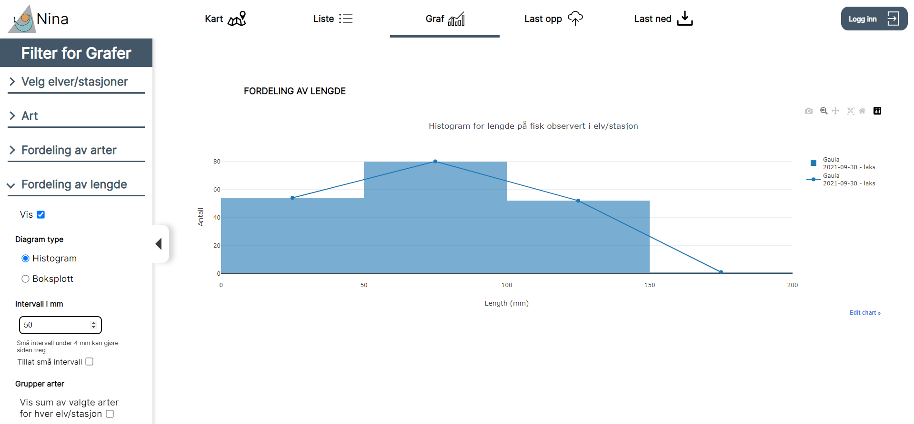

Histogram er greit når det bare er en/noen få arter, men for mange arter blir figuren fort veldig komplisert. En ting man kan gjøre er gruppere sammen alle arter for hver stasjon/elv. Dette gjør man med å krysse av på "Vis sum av valgte arter for hver elv/stasjon". Dette er kan være nyttig for å sammenligne den gjennomsnittlige lengden av alle arter mellom to stasjoner i samme elv. 

En annen måte å få oversikt over mange ulike arter er å benytte boksplott. **forklar hva boksplott er**. Dette er slik lengdefordelingen av alle arter observert i stasjon Gaula 1 ser ut.

Det er mulig å bruke menyen på siden av figuren for at ting skal bli lettere å forstå, men det beste er å bytte til boksplott. **forklar mer om boksplott**

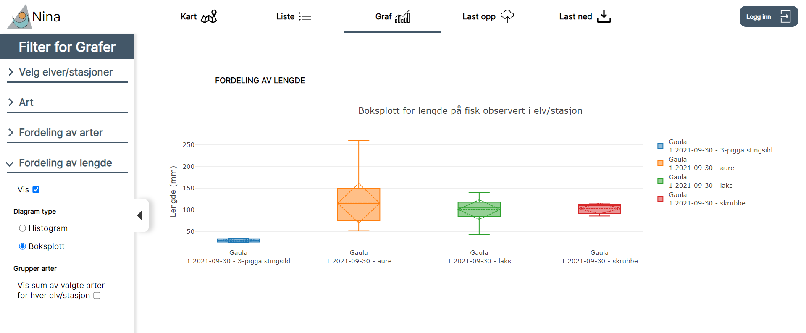

# Hvordan laste opp ny data

På denne siden finnes to knapper. Den ene brukes for å velge hvilke filer man skal laste opp (1), mens den andre brukes for å laste opp de valgte filene (2).

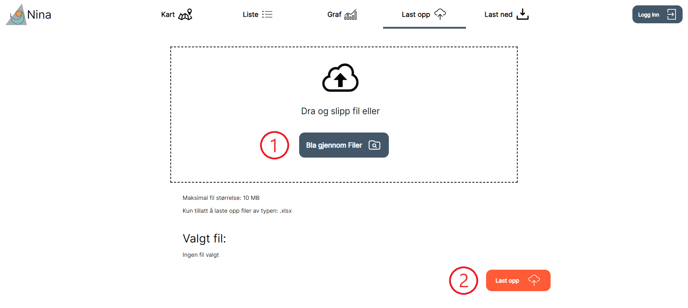

Når man trykker på knapp 1 så opner den opp "file explorer" på din pc. Da er det bare å bla seg fram til filen man ønsker å laste opp, velge den, for så å trykke åpne. Man har bare mulighet til å velge excel filer, siden disse er de eneste filene som er godtatt. Filer som ikke følger riktig format vil heller ikke bli lastet opp, så den kan være lurt å sjekke dette før man laster opp.

Når man har valgt filen så er det bare å trykke last opp. 

Hvis man "refresher" nettsiden, så skal dataene man har lastet opp nå vises. Dette kan man lett sjekke ved å søke etter stasjonen/elven på liste siden. **spør om dette**

# Hvordan laste ned data

Det første en burde tenke på er om man ønsker å laste ned data for en/flere elver, eller data for en/flere stasjoner. For å vite hva man ønsker å laste ned kan det være lurt å benytte en av de andre sidene for å få en visualisering av dataene.

For å velge dataene man ønsker å laste ned trykker man på "rediger".

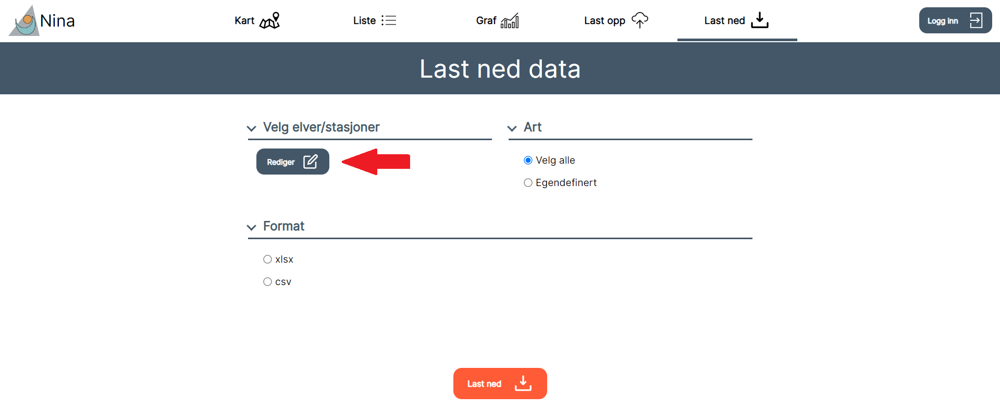

Man blir da møtt med denne menyen.

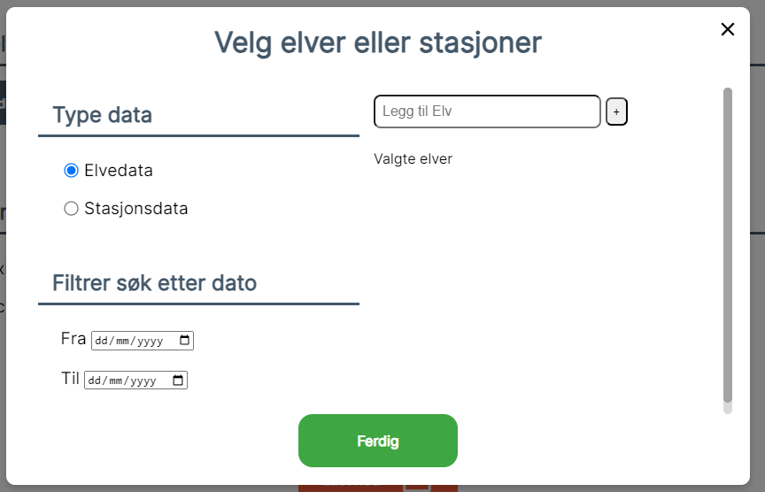

Det første man kan endre på, er om man skal laste ned "Elvedata" eller "Stasjonsdata". **Skrive noe om forskjellen mellom de**. Under dette har man mulighet til å sette et tidsrom som man ønsker å lete etter data fra. "Filtrer søk på dato" vil ikke legge til noe data, men det legger restriksjoner på hvilke stasjoner/elver som vises når man skal legge de til senere.Dette er nyttig hvis man ikke er ute etter en spesefikk elv eller stasjon, man ønsker å se på alle målinger gjort i et vist tidsrom. Det er også greit for elver/stasjoner der det er gjort målinger flere ganger, fordi da for man filtrert vekk de målingene man ikke er interessert i. 

Det siste feltet på denne siden er der man faktisk bestemmer hvilke data man vil laste ned. Det er et søkefelt, og alle stasjoner/elver som passer til søket vil vises. Husk, man får ikke opp stasjoner OG elver. Valgte man elvedata på det første feltet kan man bare søke etter elver, og valgte man stasjonsdata kan man bare søke etter stasjoner. Søkefeltet er ikke case-sensetiv og viser alle resultater som inneholder søkemønsteret som har blitt valgt. Velger man for eksempel bare å søke "a", så får man opp alle elver/stasjoner som innehoder bokstaven "a" eller "A". I dette tilfelle ønsker jeg å se noen av målingene gjort i elven Gaula. Jeg velger derfor stasjonsdata, og søker på "Ga". Jeg kunne søkt på "Gaula", men det var ingen andre stasjoner som inneholdt "Ga", så dette holdt for å få de stasjonene jeg trengte.

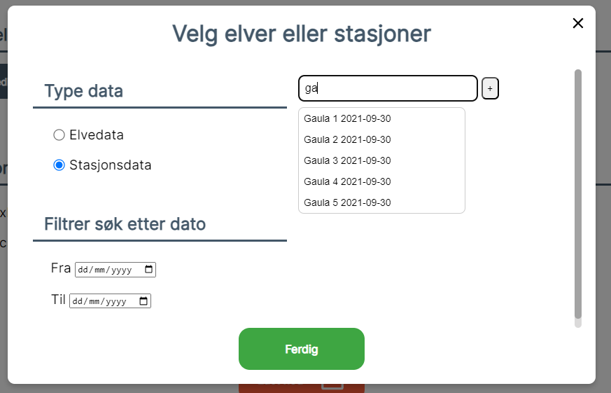

For å velge stasjonene man ønsker er det bare å trykke på de. Da dukker de opp under søkefeltet, under "Stasjoner valgt". Her kan man fjerne de, hvis man ved et uhell trykket feil kan man fjerne stasjonen ved å trykke på X-en. Noe å merke seg, er at man må gjenta søket for hver stasjon man ønsker å legge til. Hadde jeg vært usikker på hvilke av stasjonen i Gaula jeg ønsket å laste ned, så kunne jeg for eksempel brukt kartsiden og funnet stasjonene i Gaula, slik som vist under.

Jeg kan trykke på punktene, og se hvilke data som finnes under hver stasjon. Slik kan jeg dobbeltsjekke at jeg velger riktige stasjoner.

Når man har valgt elvene/stasjonene man ønsker å laste ned. Så trykker man trykke på X-en øverst i høyre hjørne, eller så kan man bare trykke utenfor selve meny-boksen.

Det neste å tenke på er hvilke arter som man vil inkludere når man laster ned.

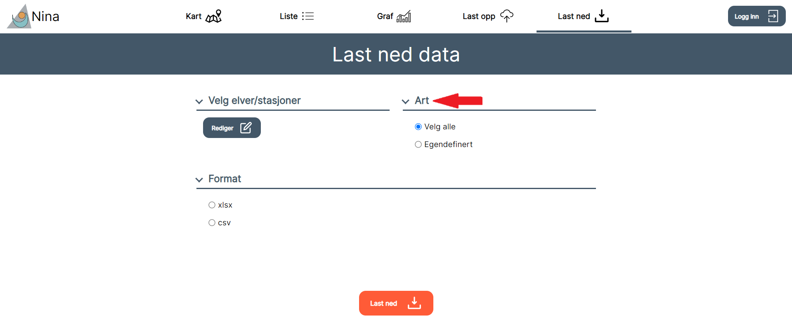

Dette er automatisk satt til "Velg alle", som betyr at hvis du ønsker fullstendig data som inkluderer alle artene så trenger du ikke endre på noe. Ønsker man bare å laste ned data for en/flere arter, så må man velge egendefinert. Deretter søker man etter art/artene man ønsker å ha med, for så å velge disse. Arter som ikke er mulige å velge, vil ikke bli vist.

**Skal man kunne velge format**

Det siste man gjør er å trykke på last ned knappen på bunnen av siden. Denne vil automatisk lage en excel som inneholder de spesifiserte dataene, og gjøre filen tilgjengelig på brukerens lokale pc.

